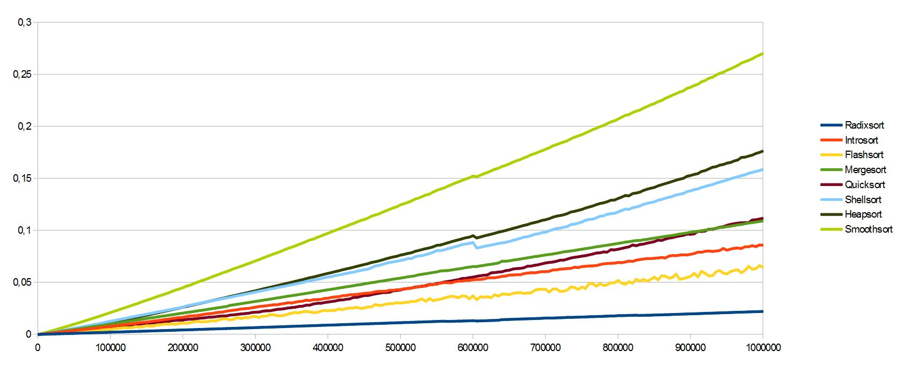
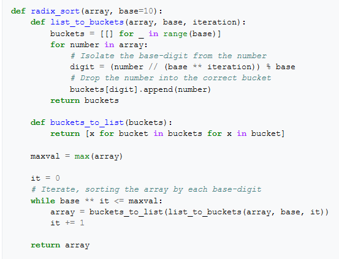

# LSD and MSD Radix Sorts on String

Radix sort is a sorting algorithm that does not involve comparing values but rather operates by grouping elements based on keys.

In this case, the project will present sorting methods called **LSD (Least Significant Digit)** and **MSD (Most Significant Digit)**.

The procedure involves grouping values based on a significant letter (which occupies the same position in all words).

- **LSD** operates from the end to the beginning of the string ←
- **MSD** operates from the beginning of the string to its end →

.png)

